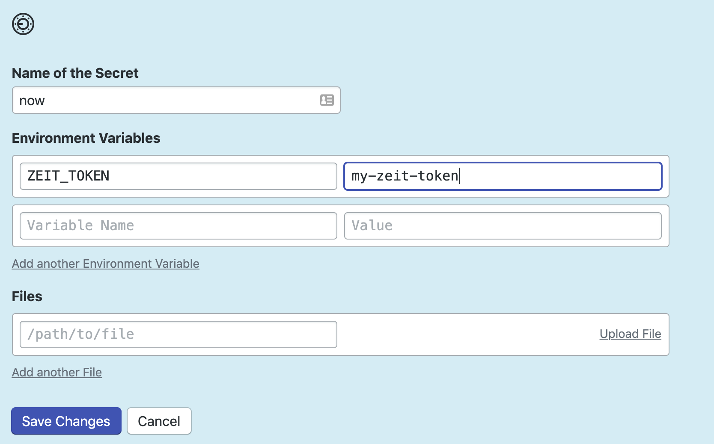

# Semaphore demo CI/CD pipeline with Zeit Now

Example how to build an Express.js Node.js project and deploy it to Zeit Now
using Semaphore.

## CI/CD on Semaphore

1. Fork this repository and use it to [create a
project](https://docs.semaphoreci.com/article/63-your-first-project).

2. Go to your Now dashboard, and [add a token](https://zeit.co/account/tokens). You should see a slightly hidden field in the middle of the page that says "Create a new token by entering its name..." I'd recommend calling it something obvious like `zeit-now-semaphoreci-yourproject`.

3. Take the token, and create an Secret and add an Environment Variable in your project's configuration in SemaphoreCI. This sample repo calls the Secret `now` and Environment Variable `ZEIT_TOKEN`,  so I'd suggest doing the same - if you change it, be aware that you'll need to change references to this token name in the sample files.

The CI pipeline will look like this:


The example pipeline contains 3 blocks:

 - Install dependencies
    -  installs and caches all npm dependencies
 - Run tests
    - Runs Tests using Jest framework (https://jestjs.io/)
 - Deply
    - Deploys the server using Zeist Now (https://zeit.co/now)

## Local project setup

### Installation

```bash
$ npm install
```

### Running the app

```bash
$ npm start
```

### Test

```bash
$ npm test
```

## License

Copyright (c) 2019 Rendered Text

Distributed under the MIT License. See the file [LICENSE.md](./LICENSE.md).
